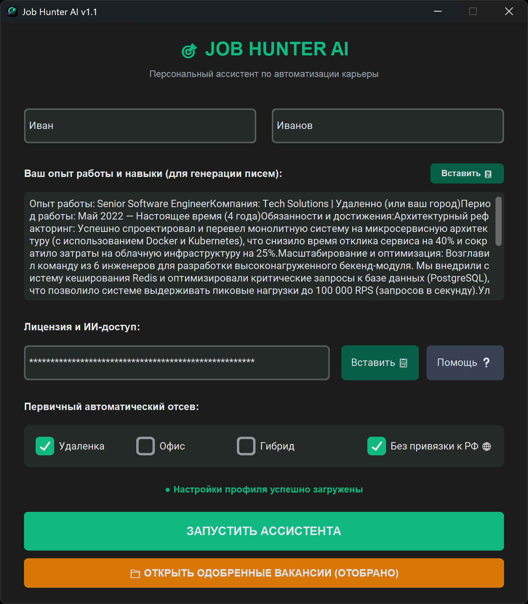
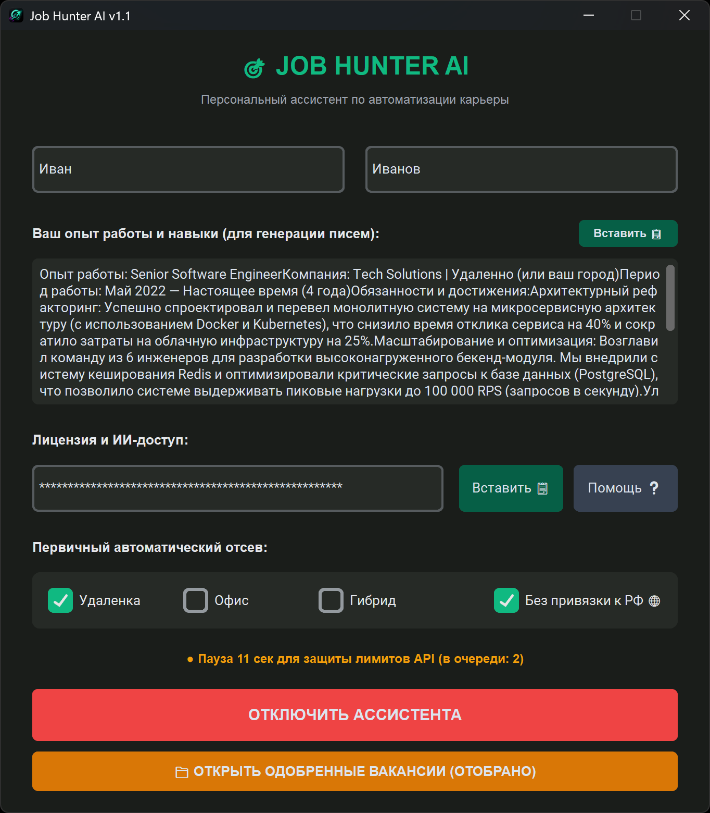

  <!-- Сам логотип. Размер регулируй через width (в пикселях) -->
  

<h1 align="center">Job Hunter AI</h1>

  <strong>Персональный интеллектуальный ассистент по автоматизации карьеры</strong>

  <!-- Сюда вставь коды своих бейджиков (просто скопируй их из старой версии) -->
  
  
  

---

**Job Hunter AI** — это полностью бесплатный личный ассистент, который избавит вас от самой нудной рутины при поиске работы. Больше не нужно часами читать тонны «воды» в описаниях вакансий и вымучивать уникальные отклики для каждого работодателя. Нейросеть сделает это за вас.

Всё работает максимально просто: вы листаете вакансии в Chrome, нажимаете одну кнопку, а программа берет всю мысленную работу на себя.

**Почему это нужно скачать прямо сейчас:**
* 💰 **Абсолютно бесплатно:** Никаких скрытых подписок. Приложение использует бесплатный ключ Gemini API, который оформляется за 1 минуту.
* 🧠 **ИИ думает за вас:** Программа за 3 секунды вчитывается в текст вакансии, сопоставляет её с вашим резюме и честно говорит, подходит она вам или нет.
* 🛡️ **Жесткий фильтр:** Нейросеть сама отсеет неподходящий стек, отсутствие удаленки или требования, под которые вы не проходите.
* ✍️ **Готовый отклик за секунды:** ИИ мгновенно пишет сильное, персонализированное сопроводительное письмо под конкретные требования компании — вам остается только скопировать и отправить.

<table width="100%">
  <tr>
    <td width="33.3%" align="center">
      <b>Главное меню (Ожидание)</b> 
      
    </td>
    <td width="33.3%" align="center">
      <b>Ассистент запущен</b> 
      
    </td>
    <td width="33.3%" align="center">
      <b>Защитная пауза и очередь</b> 
      
    </td>
  </tr>
</table>

## ✨ Что умеет ассистент (Ключевые фичи)

🎨 **Современный темный интерфейс:** Стильная темная тема, разработанная на CustomTkinter, которая бережет ваши глаза при ночной работе. Интерфейс полностью адаптирован под High-DPI экраны — шрифты и элементы будут идеально четкими как на ноутбуках, так и на больших 2K/4K мониторах.

⚡ **Анализ вакансии в один клик:** Забудьте про копирование текста вручную. Браузерное расширение для Chrome мгновенно «схватывает» всё описание вакансии прямо со страницы и само пересылает его в открытую программу. 

⏳ **Защита от блокировок (Очередь задач):** Вы можете открывать и кликать вакансии на сайтах без остановки. Ассистент сам выстроит их в очередь и обработает с безопасной паузой в 15 секунд. Это гарантирует, что ваш бесплатный API-ключ не забанят за слишком частые запросы. Удобный статус-бар на главном экране всегда покажет, сколько задач осталось и запустит обратный отсчет таймера.

🧠 **Умный ИИ-фильтр хлама:** Нейросеть безжалостно отсеивает сомнительные предложения. Сетевой маркетинг, крипто-схемы, инфобизнес, эзотерика и просто «размытые» вакансии-пустышки без четких обязанностей автоматически отправляются в корзину. Вы будете тратить время только на реальные и качественные компании.

🕒 **Защита от переработок (Анти-рабство):** ИИ внимательно вчитывается в условия и скрытый подтекст описания. Если работодатель требует рабский график (более 45 часов в неделю) или пытается навязать неоплачиваемые переработки, ассистент мгновенно забракует такое предложение.

🌍 **Жесткий гео-контроль:** Незаменимая фича для тех, кто работает удаленно из-за границы. Ассистент автоматически заблокирует вакансии, которые требуют строгого физического нахождения на территории РФ или содержат технические запреты на работу через корпоративный VPN.

📋 **Удобный журнал результатов:** Всё разложено по полочкам. Одобренные вакансии с готовыми крутыми сопроводительными письмами сохраняются в одной вкладке, а отклоненные — в другой. Причем для каждого отказа ИИ пишет честную и понятную причину. Журнал автоматически очищается (хранит до 50 записей), поэтому программа никогда не займет лишнего места на диске.

<table width="100%">
  <tr>
    <td width="50%" align="center">
      <b>Одобренные ИИ вакансии 👍</b> 
      
    </td>
    <td width="50%" align="center">
      <b>Журнал отклоненных вакансий ✕</b> 
      
    </td>
  </tr>
</table>

✍️ Генерация идеальных сопроводительных писем: Для каждой прошедшей отбор вакансии нейросеть генерирует профессиональный лаконичный отклик в 2–3 абзаца, адаптируя ваши реальные навыки под требования работодателя.

<table width="100%">
  <tr>
    <td width="50%" align="center">
      <b>📄 Исходный текст вакансии</b> 
      
    </td>
    <td width="50%" align="center">
      <b>✍️ Сгенерированное письмо</b> 
      
    </td>
  </tr>
</table>

## ⚙️ Быстрый старт

Для работы ассистента необходимо установить десктопное приложение и расширение для браузера Chrome. Полное пошаговое руководство по запуску доступно по ссылке ниже:

---

## 🛠️ Технологический стек

* **GUI-интерфейс:** Python (`customtkinter`, `tkinter`).
* **Локальный API:** `Flask`, `flask-cors` (безопасные кросс-доменные запросы от расширения).
* **Сетевой движок:** Прямые HTTP-запросы через `urllib.request` для полной защиты от кодировочных сбоев Windows.
* **ИИ-движок:** Google Gemini API (модели `gemini-3.1-flash`, `gemini-3.1-flash-lite`, `gemini-3.5-flash`).
* **База данных:** Локальные JSON-хранилища со встроенной автоочисткой логов[cite: 3].
* **Сборщик:** `PyInstaller` (автоматическая линковка тем и ресурсов).

## 🚀 История обновлений (Changelog)

### v1.1.0 (Текущая версия)
* **✨ Новые фичи:**
  * В карточки одобренных и плохих вакансий добавлены кнопки быстрого перехода («Откликнуться» / «Всё равно откликнуться»), которые автоматически открывают ссылку в браузере.
* **🐛 Исправления багов и UX:**
  * **Русская раскладка:** Починена работа системных горячих клавиш (`Ctrl+V`, `Ctrl+C`, `Ctrl+A`) — теперь они работают на любой раскладке клавиатуры.
  * **Плавный скроллинг:** Оптимизирована отрисовка списков вакансий. Убраны графические шлейфы и зависания интерфейса при перетаскивании ползунка мышью.
  * **Фикс залипания экрана:** Теперь при переключении фильтров (Одобренные / Плохие) позиция скролла автоматически сбрасывается в самый верх, открывая начало списка.

---

## 🗺️ Дорожная карта (Roadmap)

Проект активно развивается. Вот фичи, которые находятся в разработке и запланированы на ближайшие крупные релизы:

- [x] Оптимизация UI, фикс скролла и поддержка горячих клавиш на русской раскладке (v1.1.0).
- [ ] **Модульный движок (v2.0.0):** Полная перестройка логики запросов для легкого масштабирования.
- [ ] **Выбор провайдера ИИ:** Выпадающий список в интерфейсе для переключения между Gemini, DeepSeek, OpenAI и Claude.
- [ ] **Умная подстраховка (Failover Chain):** Система приоритетных каналов, которая сама переключит модель, если текущий API перегружен.
- [ ] **Локальный ИИ (В планах):** Интеграция с Ollama и LM Studio для тех, кто хочет обрабатывать вакансии локально и бесплатно.
