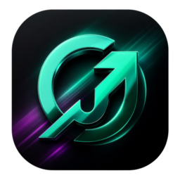

  <!-- Сам логотип. Размер регулируй через width (в пикселях) -->
  

<h1 align="center">Job Hunter AI</h1>

  <strong>Персональный интеллектуальный ассистент по автоматизации карьеры</strong>

  <!-- Сюда вставь коды своих бейджиков (просто скопируй их из старой версии) -->
  
  
  

---

#  Job Hunter AI

**Job Hunter AI** — это полностью бесплатный личный ассистент, который избавит вас от самой нудной рутины при поиске работы. Больше не нужно часами читать тонны «воды» в описаниях вакансий и вымучивать уникальные отклики для каждого работодателя. Нейросеть сделает это за вас.

Всё работает максимально просто: вы листаете вакансии в Chrome, нажимаете одну кнопку, а программа берет всю мысленную работу на себя.

 

<table width="100%">
  <tr>
    <td width="55%" valign="top">
      <h3>📌 Почему это нужно скачать прямо сейчас:</h3>
      <ul>
        <li>💰 <strong>Абсолютно бесплатно:</strong> Никаких скрытых подписок. Приложение поддерживает как бесплатные ключи Gemini, так и ключи других популярных ИИ-провайдеров.</li>
        <li>🧠 <strong>Интеллектуальный каскад:</strong> Система умеет переключаться между моделями «на лету» (Failover Chain). Если один провайдер перегружен, запрос автоматически пойдет к другому.</li>
        <li>🛡️ <strong>Бескомпромиссный отсев:</strong> Нейросеть безжалостно отсекает до 60% мусора (MLM, серые схемы, P2P, жесткие переработки более 45 часов в неделю и неподходящий стек).</li>
        <li>✍️ <strong>Готовый отклик за секунды:</strong> ИИ мгновенно пишет сильное, строгое и персонализированное сопроводительное письмо под требования компании без лишней «воды».</li>
      </ul>
    </td>
    <td width="45%" valign="middle" align="center">
      
      
<i>Главный экран ассистента во время анализа</i>

    </td>
  </tr>
</table>

 

 

## ✨ Что умеет ассистент (Ключевые фичи)

<table>
  <!-- РЯД 1: ИНТЕРФЕЙС И ХРОМ -->
  <tr>
    <td width="60%" valign="top">
      <h3>🎨 Современный темный интерфейс</h3>
      
Стильная темная тема на CustomTkinter, которая бережет ваши глаза при ночной работе. Интерфейс полностью адаптирован под High-DPI экраны — шрифты и элементы будут идеально четкими как на ноутбуках, так и на больших 2K/4K мониторах.

       
      <h3>⚡ Анализ вакансии в один клик</h3>
      
Забудьте про копирование текста вручную. Браузерное расширение для Chrome мгновенно «схватывает» всё описание вакансии прямо со страницы и само пересылает его в открытую программу.

    </td>
    <td width="40%" valign="top" align="center">
      
    </td>
  </tr>

<!-- РЯД 2: ОЧЕРЕДЬ И НЕВИДИМОСТЬ ДЛЯ САЙТОВ -->
<tr>
  <td width="60%" valign="top">
    <h3>⏳ Защита от блокировок (Очередь)</h3>
    
Вы можете открывать и кликать вакансии на сайтах без остановки. Ассистент сам выстроит их в очередь и обработает с безопасной паузой в 15 секунд. Это гарантирует, что ваш бесплатный API-ключ не забанят за частые запросы. Статус-бар всегда покажет обратный отсчет таймера.

     
    <h3>🕵️‍♂️ 100% невидимость для карьерных сайтов</h3>
    
Приложение абсолютно безопасно для ваших профилей на площадках. Расширение работает в пассивном режиме: оно не совершает авто-кликов, не спамит скрытыми запросами и не шлет бот-активности. Программа только считывает текст открытой страницы, а финальный отклик вы отправляете сами. Для алгоритмов любого сайта это выглядит так, будто обычный пользователь зашел, прочитал описание и вручную скопировал текст.

  </td>
  <td width="40%" valign="top" align="center">
    
  </td>
</tr>
  
  <!-- РЯД 3: ФИЛЬТР И НАСТРОЙКИ -->
<tr>
  <td width="60%" valign="top">
    <h3>🛡️ Тотальный ИИ-отбор и готовый отклик</h3>
    
Нейросеть берет на себя всю грязную работу: проводит жесткий гео-контроль (блокирует требования присутствия в РФ и запреты на VPN), безжалостно отсеивает хлам (MLM, крипту, инфобизнес) и защищает от переработок более 45 часов в неделю.

     
    <h3>🎛️ Интуитивный пульт управления мульти-ИИ</h3>
    
Чистый, понятный и удобный интерфейс, полностью адаптированный под работу с разными моделями. Вы можете в один клик переключаться между ИИ-провайдерами (Gemini, OpenAI, Claude, DeepSeek), настраивать ползунки задержек очереди.

  </td>
  <td width="40%" valign="top" align="center">
    
  </td>
</tr>

<!-- РЯД 4: ПИСЬМА В ОДИН КЛИК И ЖУРНАЛ РЕЗУЛЬТАТОВ -->
<tr>
  <td width="60%" valign="top">
    <h3>✍️ Вакансиеориентированные письма в один клик</h3>
    
Забудьте про шаблонные отписки, которые рекрутеры выкидывают в корзину. Для каждой одобренной вакансии ИИ мгновенно создает уникальное сопроводительное письмо, жестко заточенное под её требования и стек. Нейросеть ювелирно сопоставляет ваш реальный опыт из профиля с тем, что ищет работодатель, выдавая сильный и структурированный текст без капли «воды».

     
    <h3>📋 Прозрачный журнал результатов в AppData</h3>
    
Все обработанные предложения разложены по полочкам во вкладках «Одобренные» и «Отклоненные». Для каждого отказа ИИ пишет честную и понятную причину (например: «Мимо, стек не совпадает» или «Требуют овертаймы»). База данных изолирована в безопасной системной директории, а сам журнал автоматически держит лимит до 50 записей, не засоряя память устройства.

  </td>
  <td width="40%" valign="middle" align="center">
    
    
    
<i>Окно генерации писем (слева) и журнал логов (справа)</i>

  </td>
</tr>

## ⚙️ Быстрый старт

Для работы ассистента необходимо установить десктопное приложение и расширение для браузера Chrome. Полное пошаговое руководство по запуску доступно по ссылке ниже:

---

🗺️ Посмотреть архитектурную схему приложения (Как это работает под капотом)

 
<pre>
 ┌────────────────────────────────────────┐
 │            БРАУЗЕР CHROME              │
 │  (Пользователь кликает в расширении)    │
 └───────────────────┬────────────────────┘
                     │ 
                     │ HTTP POST ( vacancy_data )
                     ▼
 ┌────────────────────────────────────────┐
 │          ЛОКАЛЬНЫЙ FLASK API           │  [main_app.py]
 │       (Слушает порт на localhost)      │  Принимает запросы в фоне
 └───────────────────┬────────────────────┘
                     │ 
                     │ Добавляет задачу (.put)
                     ▼
 ┌────────────────────────────────────────┐
 │        ПОТОКОБЕЗОПАСНАЯ ОЧЕРЕДЬ        │  [queue.Queue]
 │    (Хранит вакансии, пока ты кликаешь) │  Защищает интерфейс от зависания
 └───────────────────┬────────────────────┘
                     │
                     │ Фоновый поток забирает 1 вакансию раз в 15 секунд
                     ▼
 ┌────────────────────────────────────────┐
 │         УМНЫЙ AI-ДВИЖОК (Gemini)       │  [ai_engine.py]
 └───────────────────┬────────────────────┘  Прямые HTTP-запросы (urllib)
                     │
         ┌───────────┴───────────┐
         ▼                       ▼
 ┌───────────────┐       ┌───────────────┐
 │   ЭТАП №1     │       │   ЭТАП №2     │
 │  Фильтрация   │       │  Генерация    │
 └───────┬───────┘       └───────┬───────┘
         │                       │
         ├─► [ОТКЛОНЕНО]         └─► [ОДОБРЕНО]
         │   (РФ-офис / Стек /       (Пишется уникальное
         │    Анти-рабство)           сопроводительное письмо)
         ▼                       ▼
 ┌────────────────────────────────────────┐
 │          STORAGE MANAGER (JSON)        │  [storage_manager.py]
 │     (Сохраняет результаты в AppData)   │  Авто-очистка логов до 50 записей
 └───────────────────┬────────────────────┘
                     │
                     │ Обновляет списки в реальном времени
                     ▼
 ┌────────────────────────────────────────┐
 │          ИНТЕРФЕЙС КЛИЕНТА             │  [results_ui.py]
 │       (CustomTkinter Темная Тема)      │  Вкладки: Текст / Письмо + Копирование
 └────────────────────────────────────────┘
</pre>

## 🛠️ Технологический стек

* **GUI-интерфейс:** Python (`customtkinter`, `tkinter`).
* **Локальный API:** `Flask`, `flask-cors` (безопасные кросс-доменные запросы от расширения).
* **Сетевой движок:** Прямые HTTP-запросы через `urllib.request` для полной защиты от кодировочных сбоев Windows.
* **ИИ-движок:** Google Gemini API (модели `gemini-3.1-flash`, `gemini-3.1-flash-lite`, `gemini-3.5-flash`).
* **База данных:** Локальные JSON-хранилища со встроенной автоочисткой логов[cite: 3].
* **Сборщик:** `PyInstaller` (автоматическая линковка тем и ресурсов).

## 🚀 История обновлений (Changelog)

### v1.1.0 (Текущая версия)
* **✨ Новые фичи:**
  * В карточки одобренных и плохих вакансий добавлены кнопки быстрого перехода («Откликнуться» / «Всё равно откликнуться»), которые автоматически открывают ссылку в браузере.
* **🐛 Исправления багов и UX:**
  * **Русская раскладка:** Починена работа системных горячих клавиш (`Ctrl+V`, `Ctrl+C`, `Ctrl+A`) — теперь они работают на любой раскладке клавиатуры.
  * **Плавный скроллинг:** Оптимизирована отрисовка списков вакансий. Убраны графические шлейфы и зависания интерфейса при перетаскивании ползунка мышью.
  * **Фикс залипания экрана:** Теперь при переключении фильтров (Одобренные / Плохие) позиция скролла автоматически сбрасывается в самый верх, открывая начало списка.

---

## 🗺️ Дорожная карта (Roadmap)

Проект активно развивается. Вот фичи, которые находятся в разработке и запланированы на ближайшие крупные релизы:

- [x] Оптимизация UI, фикс скролла и поддержка горячих клавиш на русской раскладке (v1.1.0).
- [ ] **Модульный движок (v2.0.0):** Полная перестройка логики запросов для легкого масштабирования.
- [ ] **Выбор провайдера ИИ:** Выпадающий список в интерфейсе для переключения между Gemini, DeepSeek, OpenAI и Claude.
- [ ] **Умная подстраховка (Failover Chain):** Система приоритетных каналов, которая сама переключит модель, если текущий API перегружен.
- [ ] **Локальный ИИ (В планах):** Интеграция с Ollama и LM Studio для тех, кто хочет обрабатывать вакансии локально и бесплатно.
